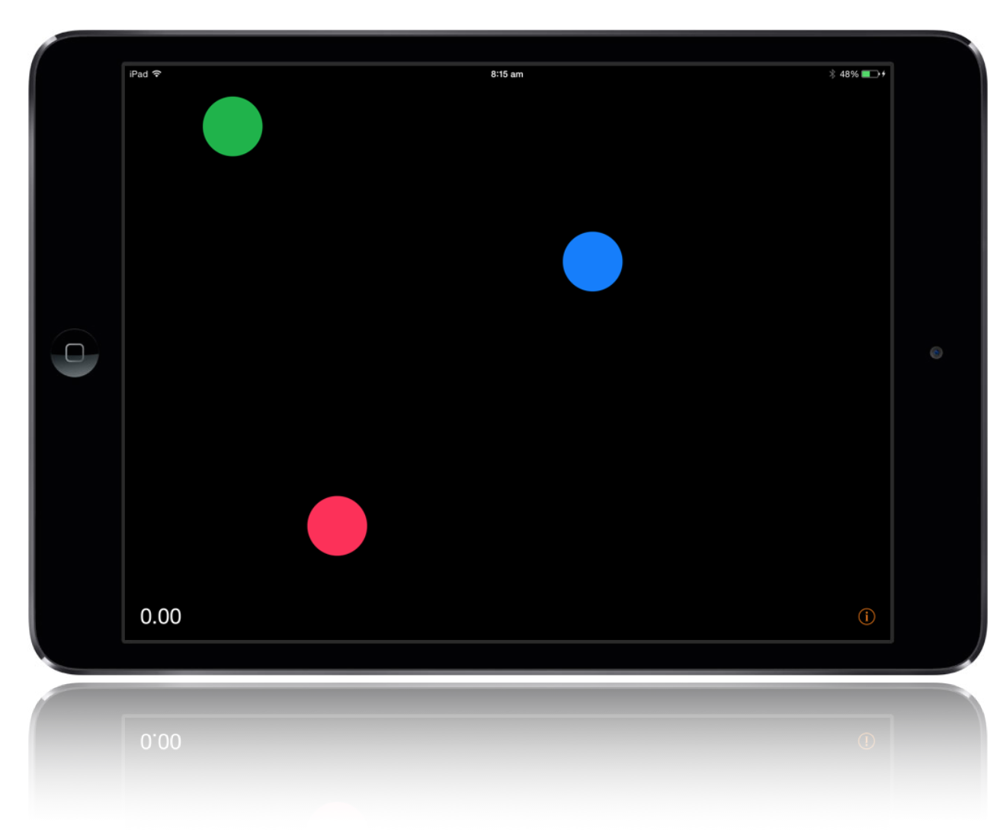

# DOMATI

This is the iOS part for Jad's Final Year Thesis on Dynamic Object Manipulation for Advanced Touch Interactions



## Abstract
Current standard touch interactions on familiar multitouch devices such as smart- phones and tablets are limited. Using motion sensors and touch data simultaneously, new interactions can be detected to facilitate innovative ways of controlling software applications.

This Final Year Project aims to produce a user calibrated algorithm that calculates the strength of a touch on a capacitive display device. This is achieved by the use of its movements in 3D space as well as the properties of the touch. Two algorithms are designed, implemented and compared. The algorithms, named “passive” and “active”, are used to record the device’s movements. The optimal algorithm is then used on a population study to determine perceptions of soft, normal and hard touches. Using data from the study, the algorithms are calibrated to return a scalar touch strength value. According to the study perceptions of touch strength are universal thus allowing for a “one size fits all” algorithm.

This algorithm has the potential to improve software for scientific research, open up new user interfaces, and enrich entertainment applications.

## Mobile Application

The repository can be cloned and compiled to run the application.

To install the Cocoapods for this project run the ```pod install``` command.

## Dissertation

The paper can be viewed within the app or alternatively it can be [downloaded here](https://raw.githubusercontent.com/jad6/DOMATI-iOS/master/DOMATI/Shared/Ressources/Dissertation.pdf).
